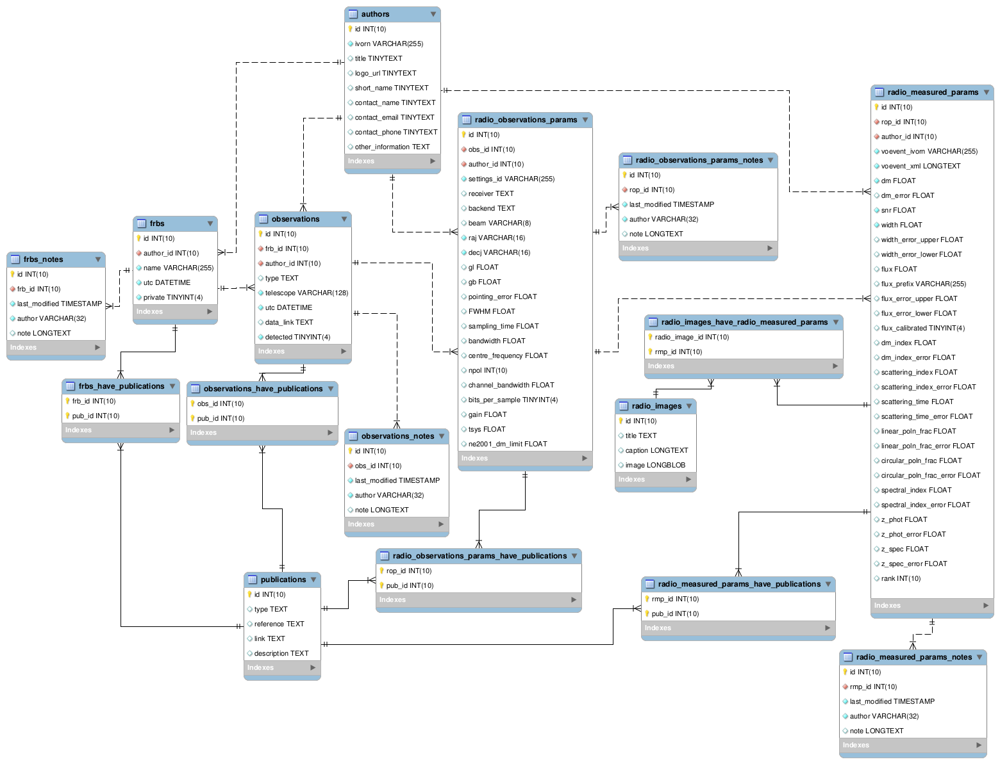

# frbcatdb

The frbcatdb is a database to store a catalog of Fast Radio Bursts (FRBs).
The DB is intended to contain old FRB events as well as new FRBs detected by the
AA-ALERT FRB detection pipeline from Apertif observations and also possible follow-up observations or others FRBs detected by other telescopes.
The frbcatdb is attached to the VOEvent backbone and uses this infrastructure as its source.

The `db` folder contains scripts to create an empty frbcat DB (`create_db.csh`),
to import it from an existing dump file (`import_db.sh`) and
to dump an existing DB to a dump file (`dump_db.csh`).
It also contains the model (Entity-Relationship diagram) to be opened with mysql-workbench. 

The `pyfrbcatdb` is Python package for manipulating the frbcatdb and its linking
with the VOEvent backbone.
